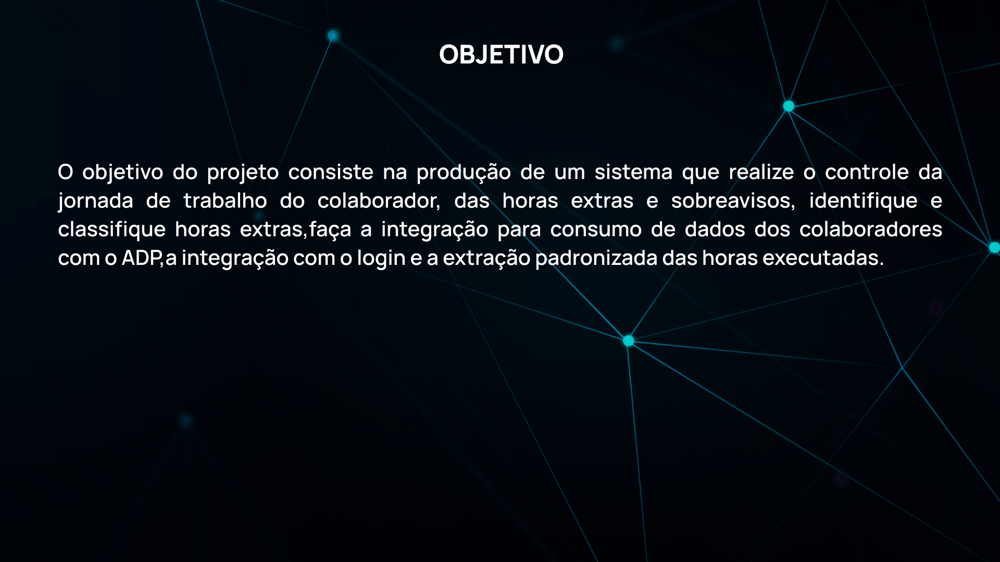
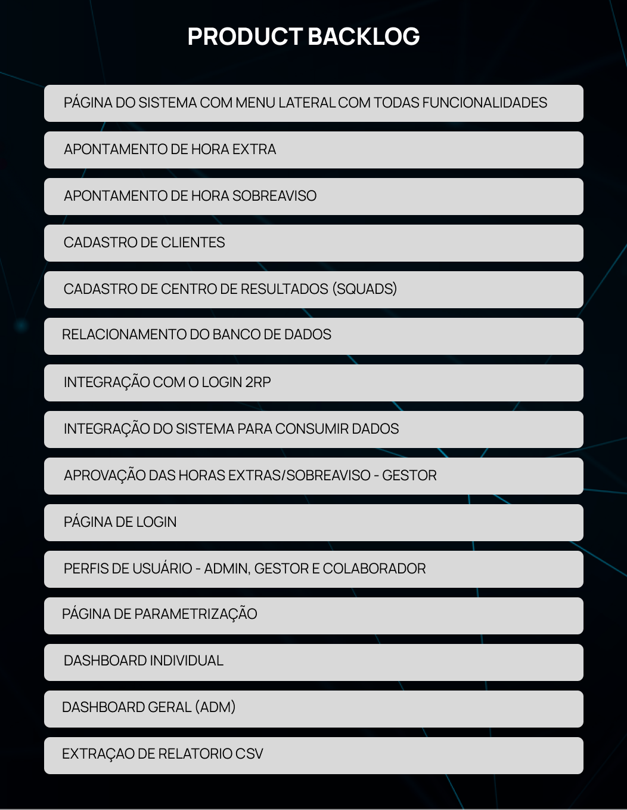
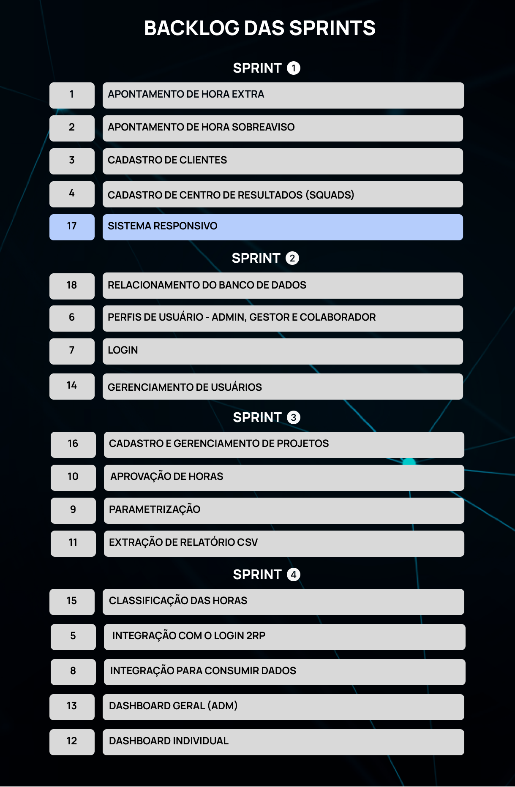
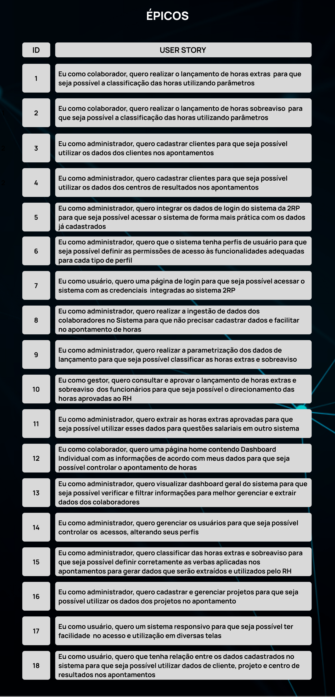
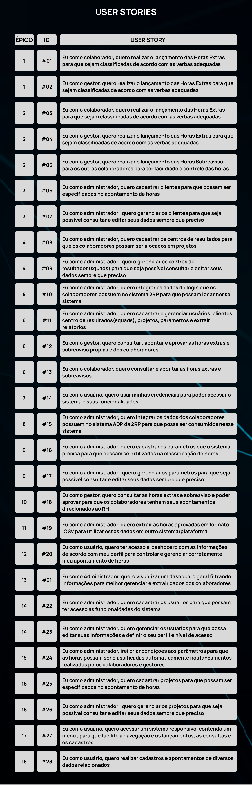
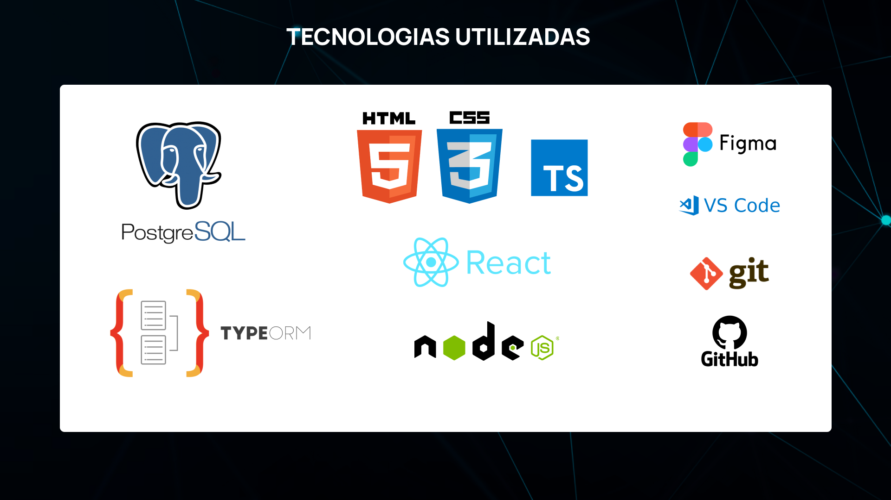

 
 

  <a href ="#o-projeto"> Projeto </a>  • 
  <a href ="#backlogs">Backlogs, Épicos & User Stories </a>  • 
  <a href ="#modelo-dados">Modelo de Dados </a>  • 
  <a href ="#cronograma-das-sprints"> Cronograma </a>  •
  <a href ="#codigo"> Código do projeto </a>  • 
  <a href ="#tecnologias-utilizadas"> Tecnologias </a>  •
  <a href ="#equipe"> Equipe </a> 
 

## :bookmark_tabs: O Projeto

 

→ [Voltar ao topo](#topo)

## :dart: Backlogs, Épicos & User Stories

	

→ [Voltar ao topo](#topo)

## :scroll: Modelo de Dados Conceitual

<h5 align="center"></h5>

## :scroll: Modelo Lógico

<h5 align="center"></h5>

→ [Voltar ao topo](#topo)

## 📆 Cronograma das Sprints

| Sprint | Previsão de entrega | Status           | Histórico |
|:--:|:----------:|:-------------------|:-------------------------------------------------:|
| 01 | 18/09/2022 | ✔️ Concluída    | [Relatório](https://github.com/Grupo1API/2RP/blob/main/readme/sprint1/README.md) |
| 02 | 09/10/2022 | ✔️ Concluída    | [Relatório](https://github.com/Grupo1API/2RP/tree/main/readme/sprint2/README.md) |
| 03 | 06/11/2022 | ✔️ Concluída    | [Relatório](https://github.com/Grupo1API/2RP/tree/main/readme/sprint3/README.md) |
| 04 | 27/11/2022 | ✔️ Concluída    | [Relatório](https://github.com/Grupo1API/2RP/tree/main/readme/sprint4/README.md) |

→ [Voltar ao topo](#topo)

## 	:computer: Código do Projeto

### :desktop_computer: [Front-end ](https://github.com/Grupo1API/2RP/tree/main/frontend)

### :gear: [Back-end ](https://github.com/Grupo1API/2RP/tree/main/backend)

→ [Voltar ao topo](#topo)

## 🖥️ Tecnologias Utilizadas

- **Banco de Dados:** PostgreSQL;
- **Back-end:** Node.js, Sequelize;
- **Front-end:** HTML, CSS, TypeScript, React;
- **Ferramentas:** Visual Studio Code, Figma, Git e Github;

 
  

→ [Voltar ao topo](#topo)

## 👨‍💻 Equipe

|    Nome     | Função    |      LinkedIn                |      GitHub    |
|:-----------: |:------|:----------------------------|---------------:|
| Douglas Queiroz | Product Owner |  |  |
| Juliana Maria | Scrum Mater |  |  | 
| Vitória Moura | Dev Team |  |  | 
| Eduardo Carvalho | Dev Team |  |  | 
| Guilherme Cursino | Dev Team |  |  | 

→ [Voltar ao topo](#topo)
