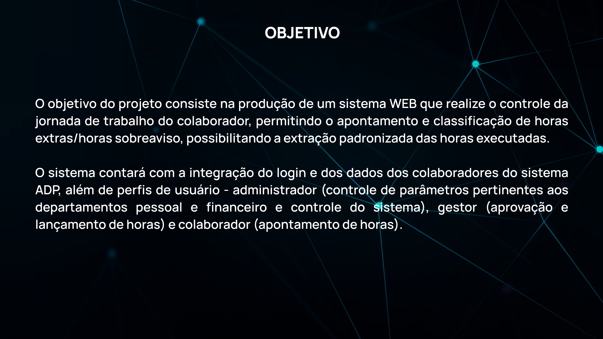
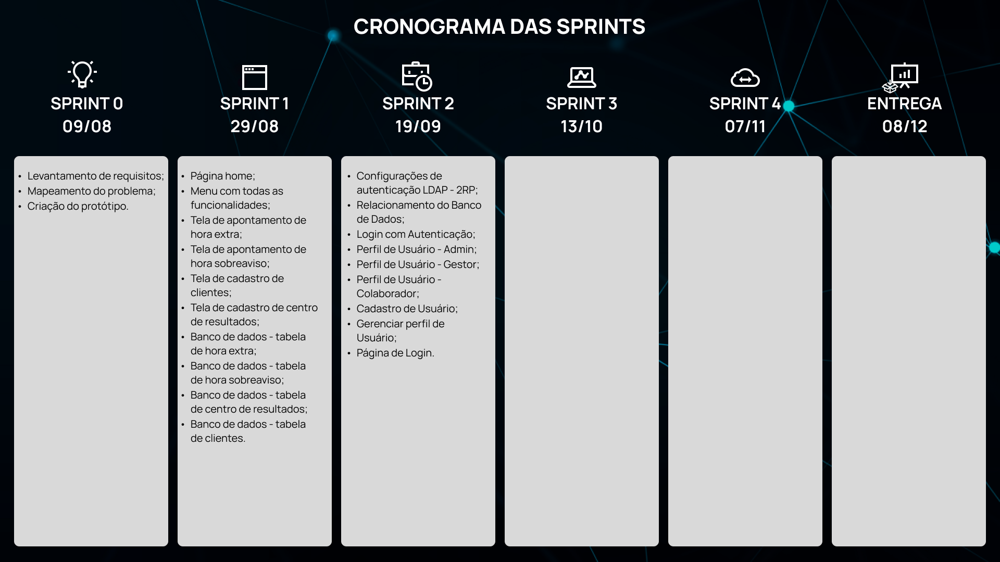

 
 

  <a href ="#o-projeto"> Projeto </a>  • 
  <a href ="#product-backlog">Product Backlog </a>  •
  <a href ="#proposta"> Proposta </a>  • 
  <a href ="#cronograma-das-sprints"> Sprints </a>  • 
  <a href ="#tecnologias-utilizadas"> Tecnologias </a>  •
  <a href ="#table_equipe"> Equipe </a> 
 

 

# O Projeto

<h1 align="center"> 
</h1>

 

## 📋 Product Backlog

<h1 align="center">
</h1>

 

## 🎯 Proposta

### **Desenvolver um sistema WEB que atenda as necessidades da empresa:**  

### **Requisitos funcionais**

-  apontamento de horas extras e classificação das horas;
-  Lançamento de horas de sobreaviso;
-  Cadastro de clientes e CRs;
-  Integração com o login 2RP;
-  Integração para consumir os dados: matrícula, nome completo, turno;
-  Perfis de usuário (administrador, gestor e colaborador);
-  Recurso para aprovação de horas extras executadas;
-  Tela de parametrização de sistema;
-  Aplicar regras de horas extras e sobreavisos na extração (classificação de HEs e cálculo do sobreaviso considerando as HEs conflitantes);
-  Extração de relatório csv de todos os colaboradores com as horas trabalhadas;
-  Dashboard com acompanhamento em tempo real das horas extras executadas com filtro cliente, CR e colaborador;

### **Requisitos não funcionais**

-  Responsividade;

<h1 align="center">
 

## 📆 Cronograma das Sprints

-  Kick-Off - 16/08/2022
- Sprint 1 - 29/08/2022 a 18/09/2022
- Sprint 2 - 19/09/2022 a 09/10/2022
- Sprint 3 - 13/10/2022 a 06/11/2022
- Sprint 4 - 07/11/2022 a 27/11/2022
- Feira de Soluções - 08/12/2022

 

 
<h1 align="center"> 
</h1>

## 🖥️ Tecnologias Utilizadas

- **Banco de Dados:** PostgreSQL;
- **Back-end:** TypeORM;
- **Front-end:** HTML, CSS, TypeScript, React;
- **Ferramentas:** Visual Studio Code, Figma, Git e Github;

<h1 align="center"> 
  
</h1>

## 👨‍💻 Equipe

    <table>
      <tr id="head_table">
        <th>Nome</th>
        <th>Função</th>
        <th>LinkedIn</th>
        <th>GitHub</th>
        <th>Avatar</th>
      </tr>
	    <tr id="linha_table">
        <td>Juliana Maria</td>
        <td>Scrum Master</td>
        <td><a href="https://www.linkedin.com/in/juliana-maria-a0b0a0124">@LinkedIn</a></td>
        <td><a href="https://github.com/JulianaMaria-Lab">@GitHub</a></td>
        <td></td>
      </tr>
	    <tr id="linha_table">
        <td>Douglas Queiroz</td>
        <td>Product Owner</td>
        <td><a href="https://www.linkedin.com/in/douglas-queiroz-3b9a72212/">@LinkedIn</a></td>
        <td><a href="https://github.com/douglaswe">@GitHub</a></td>
        <td> </td>
      </tr>
	    <tr id="linha_table">
        <td>Francisco Quirino</td>
        <td>Desenvolvedor</td>
        <td><a href="https://www.linkedin.com/in/francisco-quirino-4087281b1">@LinkedIn</a></td>
        <td><a href="https://github.com/ciscoquirino">@GitHub</a></td>
        <td></td>
      </tr>
      <tr id="linha_table">
        <td>Vitória Moura</td>
        <td>Desenvolvedora</td>
        <td><a href="https://www.linkedin.com/in/vit%C3%B3ria-moura-6393391b0/">@LinkedIn</a></td>
        <td><a href="https://github.com/vitoriasaturnino">@GitHub</a></td>
        <td></td>
      </tr>
      <tr id="linha_table">
        <td>Eduardo Pereira Carvalho</td>
        <td>Desenvolvedor</td>
        <td><a href="https://www.linkedin.com/in/eduardo-carvalho-0a1411213/">@LinkedIn</a></td>
        <td><a href="https://github.com/EduardoPereiraCarvalho">@GitHub</a></td>
        <td><!----></td>
      </tr>
      <tr id="linha_table">
        <td>Guilherme Alves Cursino</td>
        <td>Desenvolvedor</td>
        <td><a href="https://www.linkedin.com/in/guilherme-cursino-679410213/">@LinkedIn</a></td>
        <td><a href="https://github.com/guilherme0066">@GitHub</a></td>
        <td><!----></td>
      </tr>
    </table>
  

