<h1>:ballot_box_with_check: SPRINT 1</h1>

O desenvolvimento do projeto foi focado em oferecer ao cliente as principais telas de cadastros e as respectivas tabelas no banco de dados.

<h1>Sumário</h1>
<a href="#dor">DOR (Definition od Ready)</a>    
<a href="#backlog_sprint_1">Backlog Sprint 1</a>    
<a href="#modelo_de_dados">Modelo de dados</a>    
<a href="#mockups">Mockups</a>    
<a href="#burndown_sprint_1">Burndowm Sprint 1</a>    
<a href="#dod">DOD (Definition of Done)</a>    
<a href="#funcionalidades_sprint_1">Funcionalidades implementadas</a>

 

<h1 id="dor">Definition of Ready</h1>
 

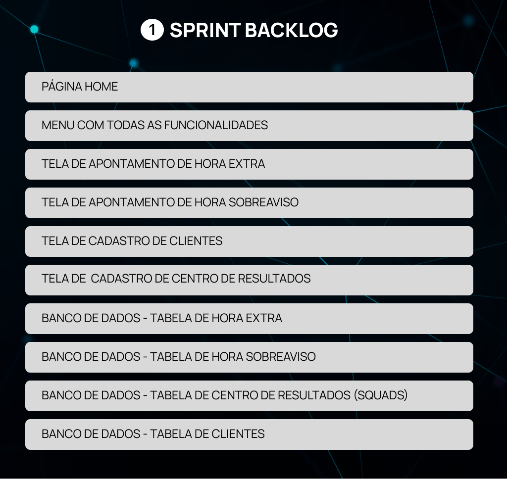</h1>

 

<h2 id="modelo_de_dados">Modelo de dados</h2>

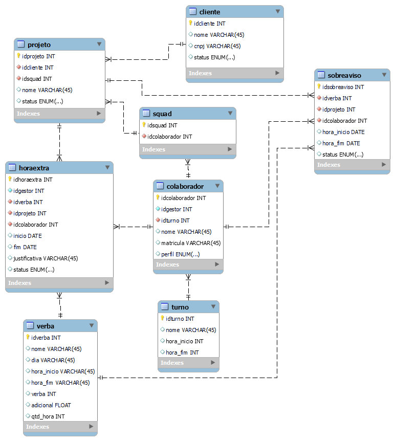

 

<h2 id="mockups">Mockups</h2>

<h3 align="center">Página Home e Menu com as Funcionalidades                        
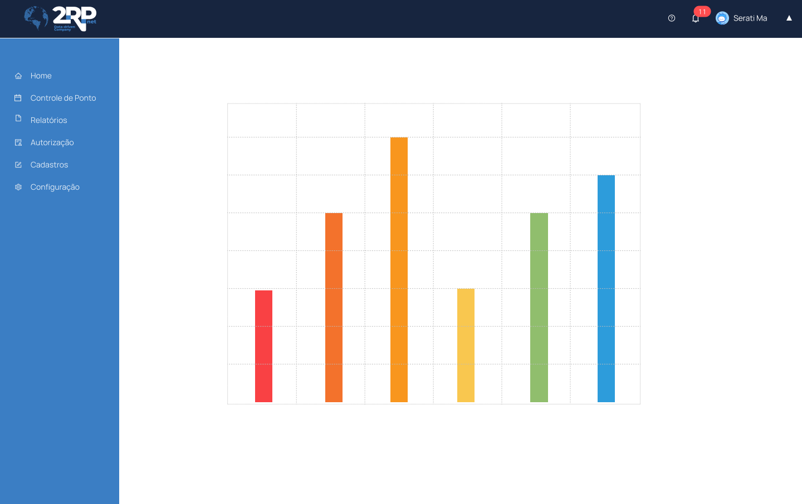</h3> 
       

<h3 align="center"> Cadastro de Cliente </h3>
<h3 align="center">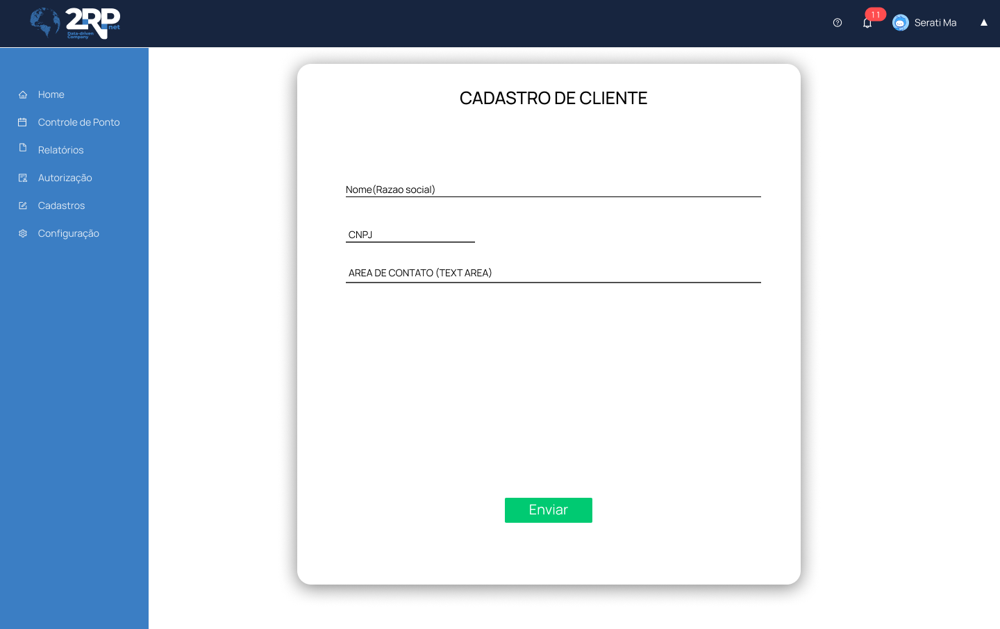

<h3 align="center">Cadastro de Centro de Resultado                              
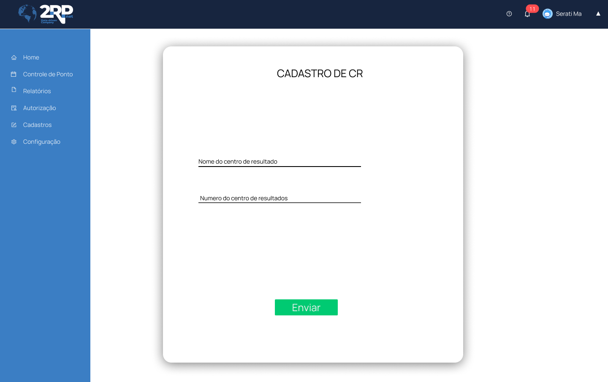</h3>

<h3 align="center">Apontamento de Hora Extra                                  
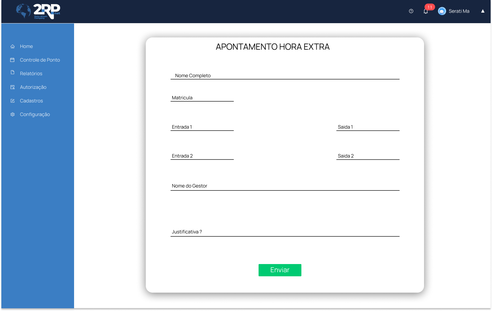</h3>

<h3 align="center">Apontamento de Hora Sobreaviso                  
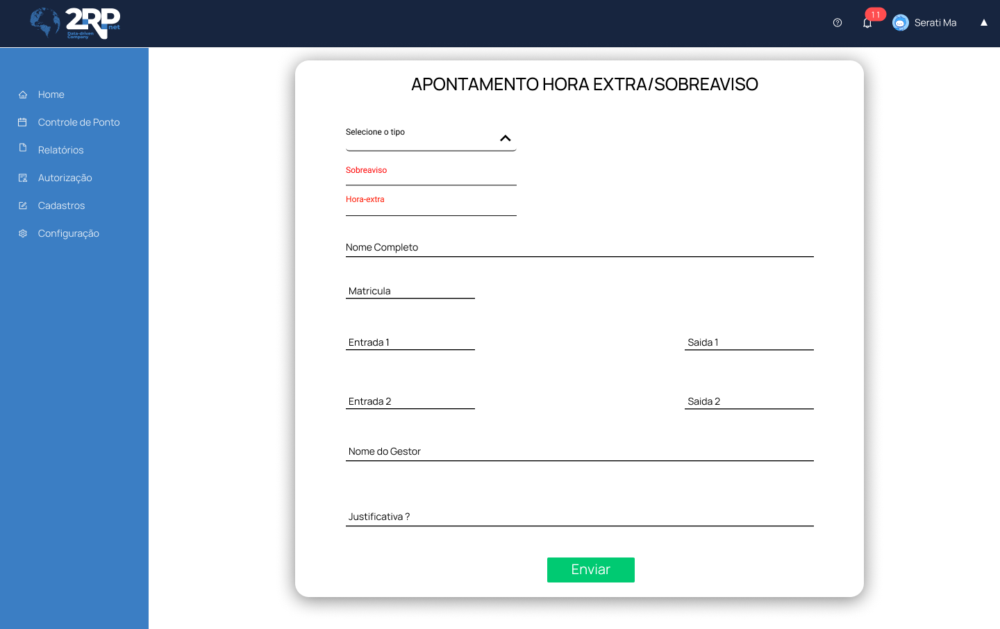</h3>

 

<h2 id="burndown_sprint_1">Burndown da Sprint<h2>

<h3 align="center">
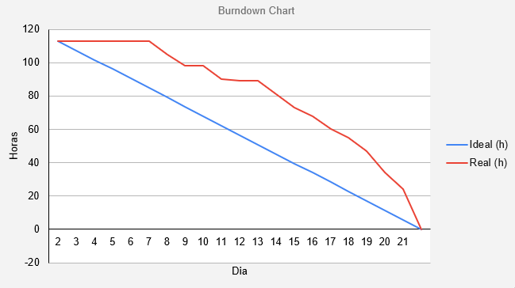</h3>

 

<h1 id="dod">Definition of Done<h1>

<h2 id="funcionalidades_sprint_1">Funcionalidades da Sprint</h2>

<h3 align="center">Página Home + Menu com as Funcionalidades</h3>
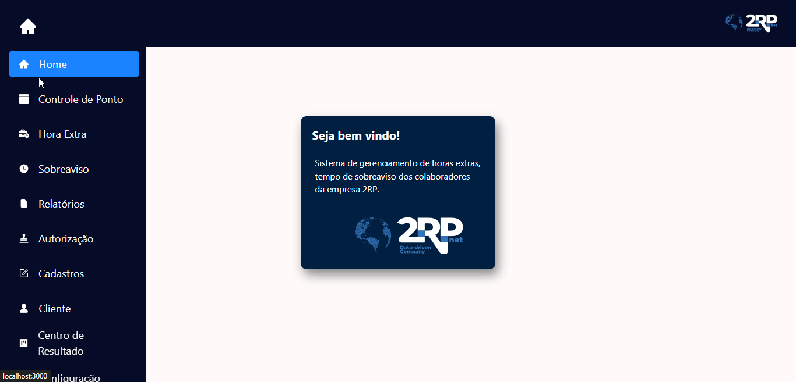

 

<h3 align="center">Cadastro de Clientes</h3>
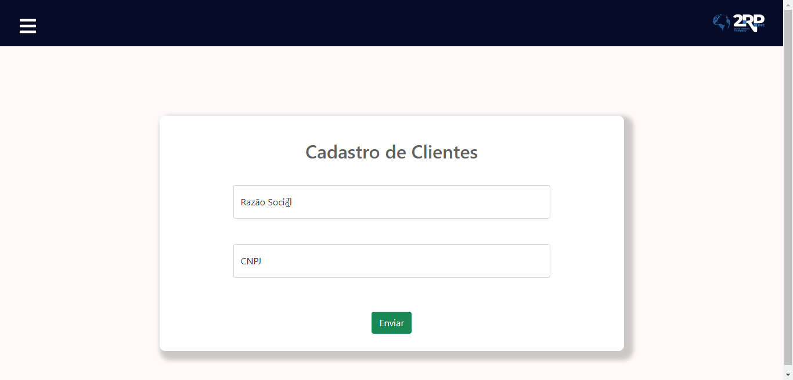

 

<h3 align="center">Cadastro de Centro de Resultado</h3>
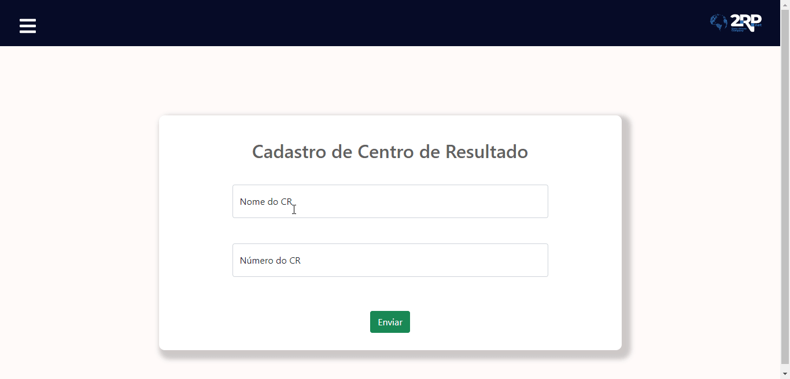

 

<h3 align="center">Apontamento de Hora Extra</h3>
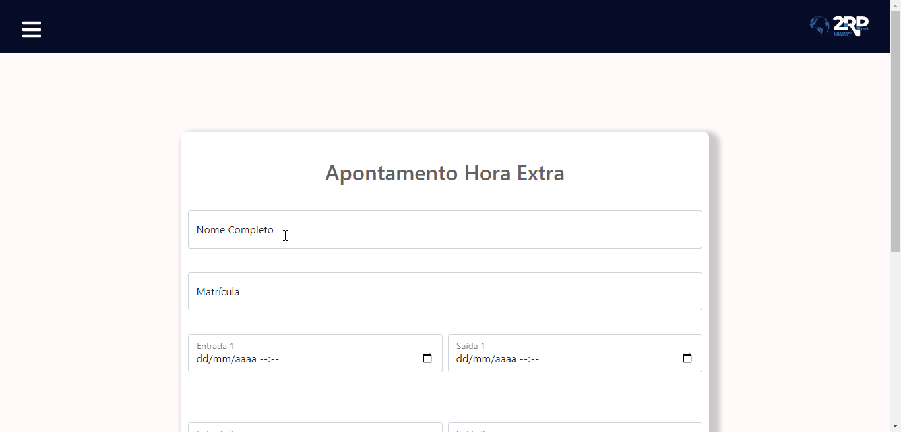

 

<h3 align="center">Apontamento de Hora Sobreaviso</h3>
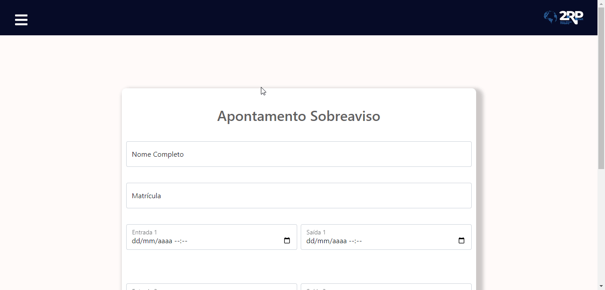

 
