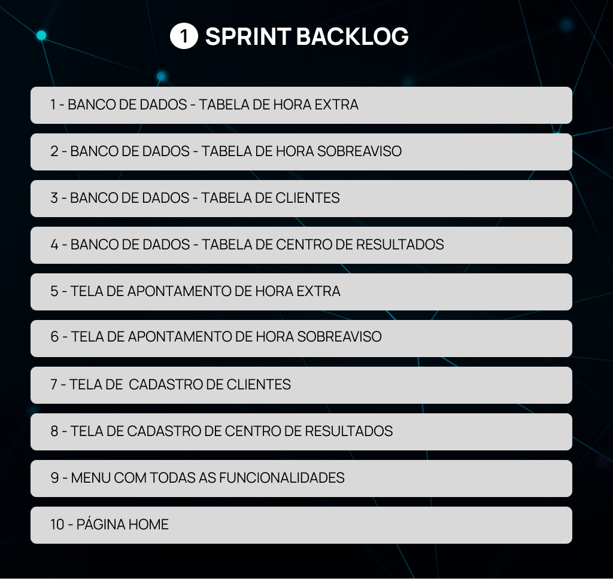

<h1>:ballot_box_with_check: SPRINT 1</h1>

O desenvolvimento do projeto foi focado em oferecer ao cliente as principais telas de cadastros e as respectivas tabelas no banco de dados.

<h1>Sumário</h1>
<a href="#dor">DoR (Definition of Ready)</a>    
<a href="#backlog_sprint_1">Backlog Sprint 1</a>    
<a href="#use_cases">Use Cases</a>    
<a href="#modelo_de_dados">Modelo de dados</a>    
<a href="#mockups">Mockups</a>    
<a href="#burndown_sprint_1">Burndowm Sprint 1</a>    
<a href="#dod">DoD (Definition of Done)</a>    
<a href="#funcionalidades_sprint_1">Funcionalidades implementadas</a>

 
<h1 id="dor">Definition of Ready</h1>

<h2 id="backlog_sprint_1">Backlog Sprint 1</h2>

</h1>

 

<h2 id="use_cases">Use Cases</h2>

  <table align="justify">
    <tr>
      <th>User Story id</th>
      <th>Como um ...</th>
      <th>Eu quero ...</th>
      <th>Para que seja possível ...</th>
      <th>Prioridade</th>
    </tr>
    <tr>
      <td>1</td>
      <td>Gestor e Colaborador</td>
      <td>Apontar o lançamento de Hora Extra</td>
      <td>Criar página de apontamento de Hora Extra </td>
      <td>1</td>
    </tr>
    <tr>
      <td>2</td>
      <td>Gestor e Colaborador</td>
      <td>Apontar o lançamento de Horas Sobreaviso</td>
      <td>Criar página de apontamento Hora Sobreaviso</td>
      <td>2</td>
    </tr>
    <tr>
      <td>3</td>
      <td>Administrador</td>
      <td>Cadastrar Clientes</td>
      <td>Formulário de cadastro de clientes </td>
      <td>4</td>
    </tr>
    <tr> 
      <td>4</td>
      <td>Administrador</td>
      <td>Cadastrar Centro de Resultados - Squads</td>
      <td>Formulário de cadastro de Centro de Resultaldo (Squad)</td>
      <td>5</td>
    </tr>
    <tr>
      <td>9</td>
      <td>Administrador, Gestor e Colaborador </td>
      <td>Página principal (Home) e navegação pelas funcionalidades através de um Menu</td>
      <td>Criar a página home e o menu funcional</td>
      <td>14</td>
    </tr>
  </table>

<h2 id="modelo_de_dados">Modelo de dados</h2>

 

<h2 id="mockups">Mockups</h2>

<h3 align="center">Página Home e Menu com as Funcionalidades                        
</h3> 
       

<h3 align="center"> Cadastro de Cliente </h3>
<h3 align="center">

<h3 align="center">Cadastro de Centro de Resultado                              
</h3>

<h3 align="center">Apontamento de Hora Extra                                  
</h3>

<h3 align="center">Apontamento de Hora Sobreaviso                  
</h3>

 

<h2 id="burndown_sprint_1">Burndown da Sprint<h2>

 

<h1 id="dod">Definition of Done<h1>

<h2 id="funcionalidades_sprint_1">Funcionalidades da Sprint</h2>

<h3 align="center">Página Home + Menu com as Funcionalidades</h3>

 

<h3 align="center">Cadastro de Clientes</h3>

 

<h3 align="center">Cadastro de Centro de Resultado</h3>

 

<h3 align="center">Apontamento de Hora Extra</h3>

 

<h3 align="center">Apontamento de Hora Sobreaviso</h3>

 
