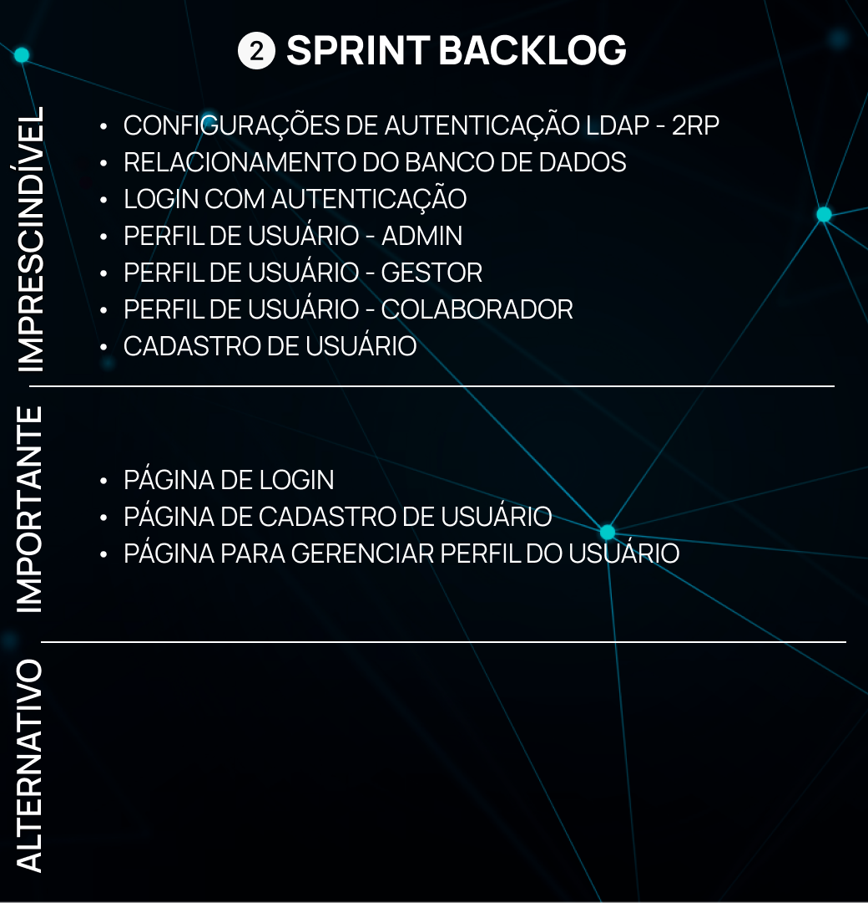

<h1>:ballot_box_with_check: SPRINT 2</h1>

O desenvolvimento nesta sprint foi focado na implementação da ligação entre as tabelas do banco de dados, no login e os níveis de acesso de Administrador, Gestor e Colaborador e as configurações de autenticação
LDAP (Lightweight Directory Access Protocol). 

<h1>Sumário</h1>
<a href="#dor">DoR (Definition of Ready)</a>    
<a href="#backlog_sprint">Backlog Sprint 2</a>    
<a href="#backlog_sprint_priorizacao">Backlog Sprint 2 - Ordem de Prioridade</a>    
<a href="#use_cases">Use Cases</a>    
<a href="#modelo_de_dados">Modelo de dados</a>    
<a href="#burndown_sprint">Burndowm Sprint 2</a>    
<a href="#dod">DoD (Definition of Done)</a>    
<a href="#funcionalidades_sprint">Funcionalidades implementadas</a>

 
<h1 id="dor">Definition of Ready</h1>

<h2 id="backlog_sprint">Backlog Sprint 2</h2>

</h1>

 

<h2 id="backlog_sprint_priorizacao">Backlog Sprint 2 - Ordem de Prioridade</h2>

</h1>

 

<h2 id="use_cases">Use Cases</h2>

  <table align="justify">
    <tr>
      <th>User Story id</th>
      <th>Como (ator)</th>
      <th>Eu quero (ação)</th>
      <th>Para que seja possível (funcionalidade)</th>
      <th>Prioridade</th>
    </tr>
    <tr>
      <td>4</td>
      <td>Administrador</td>
      <td>Configurações de autenticação LDAP para integração de dados da 2RP</td>
      <td>Realizar configurações de protocolo e de conexão do servidor da 2RP através de LDAP (Lightweight Directory Access Protocol) </td>
      <td>8</td>
    </tr>
    <tr>
      <td>19</td>
      <td>Administrador</td>
      <td>Nos cadastros e apontamentos alguns dados de outras tabelas devem ser especificados (turno, verbas, cliente, projeto, centro de resultado)</td>
      <td>Relacionamento do banco de dados para que seja possível que essas especificações sejam feitas automaticamente </td>
      <td>11</td>
    </tr>	
    <tr>
      <td>1</td>
      <td>Administrador, Gestor e Colaborador</td>
      <td>Perfis de usuário</td>
      <td>Criar login com níveis de acesso e autenticação</td>
      <td>13</td>
    </tr>
    <tr>
      <td>18</td>
      <td>Administrador, Gestor e Colaborador</td>
      <td>Página para realizar o Login no sistema</td>
      <td>Criar a página de login </td>
      <td>14</td>
	<tr>
	  <td>21</td>
      <td>Administrador</td>
      <td>Página para gerenciar perfis de usuários do sistema</td>
      <td>Criar a página do Admin para gerenciar os perfis de acesso dos usuários</td>
      <td>16</td>
	 </tr>
    </tr>
  </table>

<h2 id="modelo_de_dados">Modelo de dados - Conceitual</h2>

 

<h2 id="modelo_de_dados">Modelo de dados - Lógico </h2>

 

<h2 id="burndown_sprint">Burndown da Sprint<h2>

 

<h1 id="dod">Definition of Done<h1>

<h2 id="funcionalidades_sprint">Funcionalidades da Sprint</h2>

<h3 align="center">Página de Login</h3>

 

<h3 align="center">Autenticação do Login</h3>

 

<h3 align="center">Cadastro de Usuário</h3>

 

<h3 align="center">Gerenciamento de Usuário</h3>

 

<h3 align="center">Relacionamento do Banco de Dados</h3>

 
<h4>Requests evidenciando o relacionamento do banco de dados:</h4> 
- Cadastro de Colaborador utilizando Id do turno;  
- Cadastro de Usuário com o Id do colaborador;  
- Cadastro de Centro de Resultado incluindo Id do colaborador, Id do gestor e Id do Projeto.  
- Cadastro de Projeto com o Id do Cliente;  
- Apontamento de Hora incluindo Id do colaborador, Id do gestor e Id do Projeto e Relacionamento da Verba com o Apontamento através do Id.  

 

 
