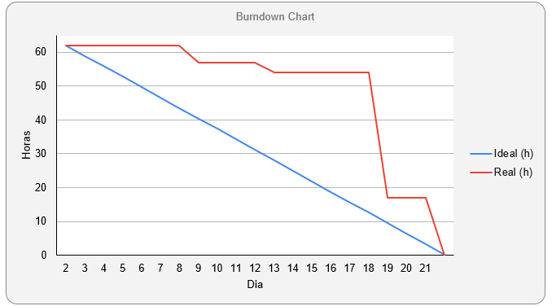

<h1>:ballot_box_with_check: SPRINT 3</h1>

O desenvolvimento nesta sprint foi focado na implementação do gerenciamento dos clientes/projetos, consulta e aprovação de horas apontadas e parametrização. 

<h1>Sumário</h1>
<a href="#dor">DoR (Definition of Ready)</a>    
<a href="#backlog_sprint">Backlog Sprint 3</a>    
<a href="#use_cases">Use Cases</a>    
<a href="#burndown_sprint">Burndowm Sprint 3</a>    
<a href="#dod">DoD (Definition of Done)</a>    
<a href="#funcionalidades_sprint">Funcionalidades implementadas</a>

 
<h1 id="dor">Definition of Ready</h1>
<h2 id="backlog_sprint">Backlog Sprint 3</h2>

</h1>

 

<h2 id="use_cases">Use Cases</h2>

</h1>

 

<h2 id="burndown_sprint">Burndown da Sprint<h2>

 

<h1 id="dod">Definition of Done<h1>

<h2 id="funcionalidades_sprint">Funcionalidades da Sprint</h2>

<h3 align="center">Quadro de exibição de Clientes/Projetos</h3>

 

<h3 align="center">Gerenciamento de Clientes/Projetos</h3>

 

<h3 align="center">Página de Parametrização</h3>

 

<h3 align="center">Cadastro e Gerenciamento de Turnos</h3>

 

<h3 align="center">Cadastro e Gerenciamento de Verbas</h3>

 

<h3 align="center">Quadro de exibição de Horas Apontadas</h3>

 

<h3 align="center">Aprovação de Horas Apontadas</h3>

