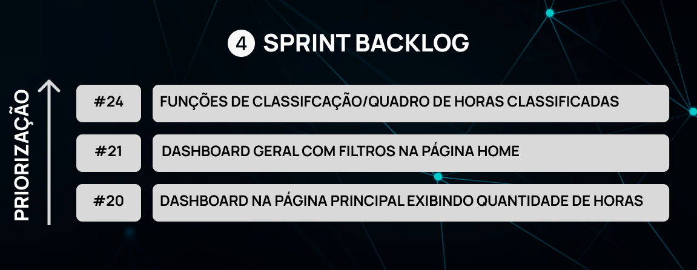
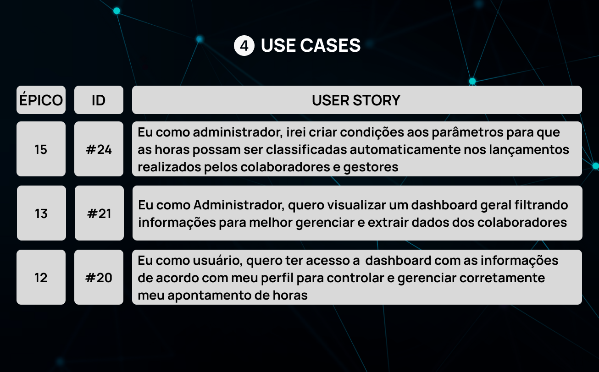
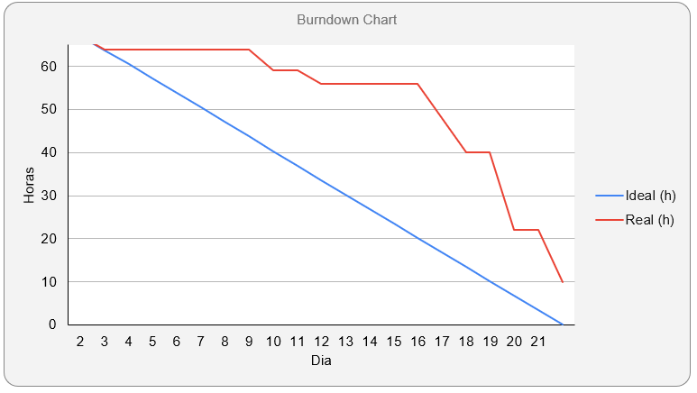
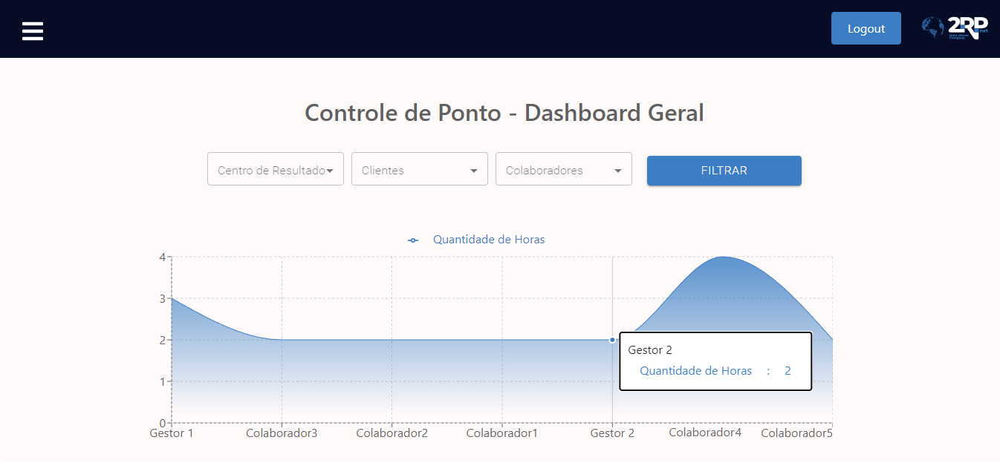
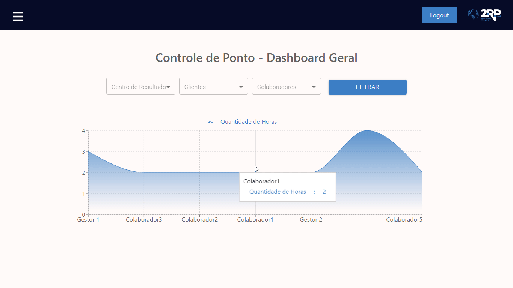

<h1>:ballot_box_with_check: SPRINT 4</h1>

O desenvolvimento nesta sprint foi focado no desenvolvimento de funções para classificação das horas extras/sobreaviso, implementação de dashboards e no ajuste de algumas funcionalidades do sistema. 

<h1>Sumário</h1>
<a href="#dor">DoR (Definition of Ready)</a>    
<a href="#backlog_sprint">Backlog Sprint 1</a>    
<a href="#use_cases">Use Cases</a>    
<a href="#burndown_sprint">Burndowm Sprint 2</a>    
<a href="#dod">DoD (Definition of Done)</a>    
<a href="#funcionalidades_sprint">Funcionalidades implementadas</a>

 
<h1 id="dor">Definition of Ready</h1>

<h2 id="backlog_sprint>Backlog Sprint 4</h2>

</h1>

 

<h2 id="use_cases">Use Cases</h2>

</h1>

 

<h2 id="burndown_sprint">Burndown da Sprint<h2>

 

<h1 id="dod">Definition of Done<h1>

<h2 id="funcionalidades_sprint">Funcionalidades da Sprint</h2>

<h3 align="center">Dashboard de Quantidade de Horas Apontadas por colaborador - Página Home</h3>

 

<h3 align="center">Dashboard - Filtros de Centro de Resultado, Cliente, Colaboradores</h3>

